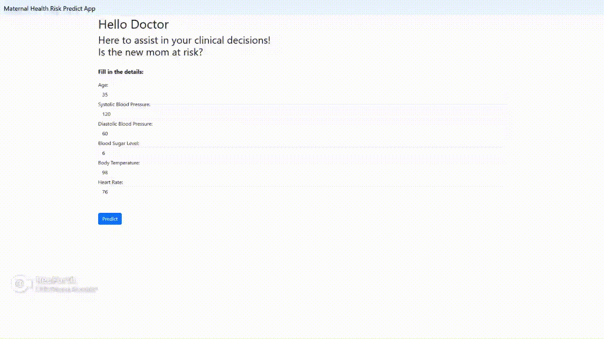

# Maternal Health Risk:

## Objective

Training and implementation of a model capable of determining the probability of postpartum maternal death.

## Introduction

Despite being underreported, the risk for postpartum women is still a global issue. According to the World Health Organization (WHO) [https://www.who.int/news-room/fact-sheets/detail/maternal-mortality], accessed on 10/10/2023, the number of maternal deaths during childbirth reached 34% per 100,000 live births between the years 2000 and 2020.

This occurs because pregnancy remains a risky period in the poorest parts of the world, where the number of deaths is still largely associated with infant and maternal mortality. In contrast, in first-world countries, mortality rates are associated with chronic diseases due to longevity.

## Methodology

The dataset used was obtained from the [UCI Machine Learning Repository](https://archive.ics.uci.edu/dataset/863/maternal+health+risk).

The models were trained using scikit-learn and monitored using the [MLFLOW](https://mlflow.org/docs/latest/quickstart.html) framework. Three experiments were conducted, each with the same classification algorithms but with modifications to the class balancing.

Metrics used to choose the best model were accuracy and precision in predicting patients at higher risk.

## Results

The model that showed the best performance was Gradient Boosting, using a dataset rebalanced with the [SMOTE](https://machinelearningmastery.com/smote-oversampling-for-imbalanced-classification/) method. It achieved an overall accuracy of 80% and a precision of 85%.

It was used in the development of a FastAPI application and its implementation is available as a Docker image.

## Conclusion

This project aims to be used as a portfolio but also to raise awareness about the risks many women still face during childbirth.

While common in deprived regions, with the advancement of the internet and telecommunications, coupled with the Internet of Things, systems and monitoring tools could be created to assist doctors in monitoring patients in more problematic cases.

## How use
In your terminal: uvicorn app:app --reload

Docker: docker run -p 80:80 maternal_risk_ml 

